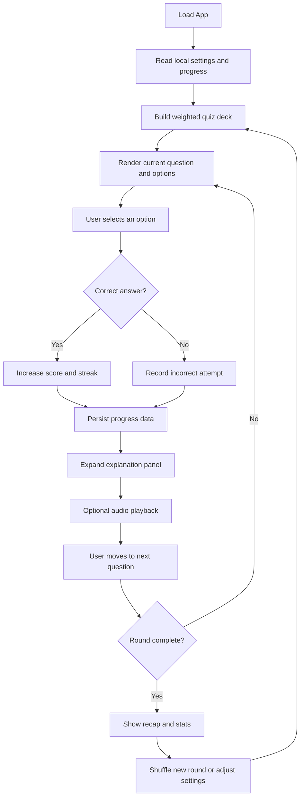

# ParlEZ

ParlEZ is a French vocabulary practice application for English speakers. It presents adaptive multiple-choice review cards, tracks progress locally, highlights weaker terms, and layers in optional audio to make repetition more engaging.

## Overview

- Adaptive quiz generation based on prior correct and incorrect answers.
- Persistent local progress, streak, theme, audio, and settings state.
- Expandable answer cards with French wording, note, example sentence, and pronunciation.
- Lightweight stats panel with session accuracy and weak-word review.
- Background music and answer sound effects with volume control.
- Mobile-focused layout adjustments for compact study sessions.

## Project Structure

```text
parlEZ/
├── public/
│   ├── audio/
│   │   └── background.mp3
│   └── favicon.png
├── src/
│   ├── components/
│   │   ├── ExplanationPanel.jsx
│   │   └── OptionCard.jsx
│   ├── data/
│   │   └── vocab.json
│   ├── hooks/
│   │   └── useSpeech.js
│   ├── lib/
│   │   ├── audioManager.js
│   │   └── buildQuizDeck.js
│   ├── App.css
│   ├── App.jsx
│   ├── index.css
│   └── main.jsx
├── index.html
├── package.json
├── vite.config.js
└── eslint.config.js
```

## Architecture Notes

- [src/main.jsx](src/main.jsx): mounts the React application.
- [src/App.jsx](src/App.jsx): central state orchestration for quiz flow, settings, persistence, stats, and audio interactions.
- [src/components/OptionCard.jsx](src/components/OptionCard.jsx): renders an answer option and its answered/expanded states.
- [src/components/ExplanationPanel.jsx](src/components/ExplanationPanel.jsx): displays the detailed explanation, example usage, and illustration placeholder.
- [src/lib/buildQuizDeck.js](src/lib/buildQuizDeck.js): builds a weighted quiz deck from the vocabulary bank and prior performance data.
- [src/lib/audioManager.js](src/lib/audioManager.js): handles background music, correct/incorrect sound effects, and volume controls.
- [src/hooks/useSpeech.js](src/hooks/useSpeech.js): wraps browser speech synthesis for French pronunciation playback.
- [src/data/vocab.json](src/data/vocab.json): vocabulary source data used to generate quiz rounds.

## Application Flow



## Data and State

- Progress is stored in browser local storage and reused to bias future rounds toward weaker items.
- Quiz deck generation uses weighted selection so incorrect or recent problem terms reappear more often.
- Theme, audio preference, round size, and background volume are persisted between sessions.

## Media Notes

- Background audio is served from [public/audio/background.mp3](public/audio/background.mp3).
- The illustration area is currently a placeholder for future image integration.
- The favicon is served from [public/favicon.png](public/favicon.png).

## Author

Simul Bista

## Copyright

Copyright © 2026 Simul Bista. All rights reserved.
