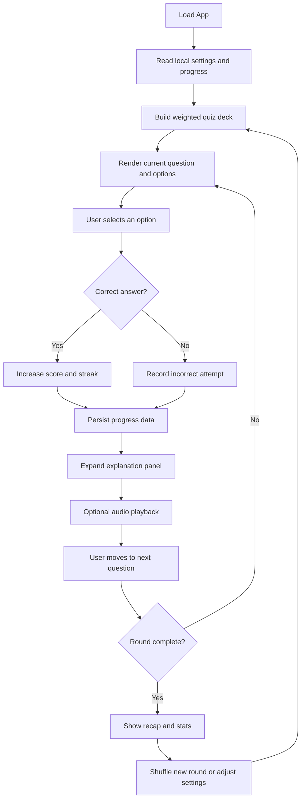

# ParlEZ

ParlEZ is a French vocabulary practice app for English speakers.

It delivers adaptive multiple-choice rounds, tracks progress locally, highlights weak terms, and supports French pronunciation playback with optional background music.

## Highlights

- Adaptive deck generation based on each term's correct and incorrect history.
- Persistent local state for progress, streaks, theme, audio preference, round size, and music volume.
- Expandable answer cards with term breakdown, usage example, and audio playback.
- Question-level pronunciation button beside the prompt term.
- Weak-word review panel with per-item clear and clear-all actions.
- Mobile-first UX improvements, including a pinned bottom action bar for Next question.
- Theme toggle, animated controls, and lightweight recap dashboard.

## Tech Stack

- React + Vite
- Framer Motion
- Web Audio API + Speech Synthesis API
- CSS variables + responsive layout breakpoints

## Getting Started

### Prerequisites

- Node.js 18+
- npm

### Install

```bash
npm install
```

### Run locally

```bash
npm run dev
```

### Production build

```bash
npm run build
```

### Preview production build

```bash
npm run preview
```

## Project Structure

```text
parlEZ/
├── public/
│   ├── audio/
│   │   └── background.mp3
│   └── favicon.png
├── src/
│   ├── components/
│   │   ├── ExplanationPanel.jsx
│   │   └── OptionCard.jsx
│   ├── data/
│   │   └── vocab.json
│   ├── hooks/
│   │   └── useSpeech.js
│   ├── lib/
│   │   ├── audioManager.js
│   │   └── buildQuizDeck.js
│   ├── App.css
│   ├── App.jsx
│   ├── index.css
│   └── main.jsx
├── index.html
├── package.json
├── vite.config.js
└── eslint.config.js
```

## Core Files

- [src/main.jsx](src/main.jsx): mounts the React application.
- [src/App.jsx](src/App.jsx): quiz flow, settings, local persistence, weak-term logic, and audio control wiring.
- [src/components/OptionCard.jsx](src/components/OptionCard.jsx): renders an answer option and its answered/expanded states.
- [src/components/ExplanationPanel.jsx](src/components/ExplanationPanel.jsx): displays the detailed explanation, example usage, and illustration placeholder.
- [src/lib/buildQuizDeck.js](src/lib/buildQuizDeck.js): builds a weighted quiz deck from the vocabulary bank and prior performance data.
- [src/lib/audioManager.js](src/lib/audioManager.js): handles background music, correct/incorrect sound effects, and volume controls.
- [src/hooks/useSpeech.js](src/hooks/useSpeech.js): wraps browser speech synthesis for French pronunciation playback.
- [src/data/vocab.json](src/data/vocab.json): vocabulary source data used to generate quiz rounds.

## How the Quiz Works



## Persistence

ParlEZ stores user state in localStorage.

- parlez-progress: term-level stats, current streak, and best streak.
- parlez-theme: light or dark theme.
- parlez-audio-enabled: global sound preference.
- parlez-settings: round size and background music volume.

Weak words are derived from stored progress, not a separate database.

## Controls and UX Notes

- Settings, theme, and audio controls are available in the quiz header.
- The weak-word pane can be opened from the stats area.
- The Next question action bar is pinned at the bottom on mobile.
- Audio controls are available in both the question prompt area and option details.

## Media

- Background audio is served from [public/audio/background.mp3](public/audio/background.mp3).
- The illustration area is currently a placeholder for future image integration.
- The favicon is served from [public/favicon.png](public/favicon.png).

## Author

Simul Bista

## Copyright

Copyright © 2026 Simul Bista. All rights reserved.
